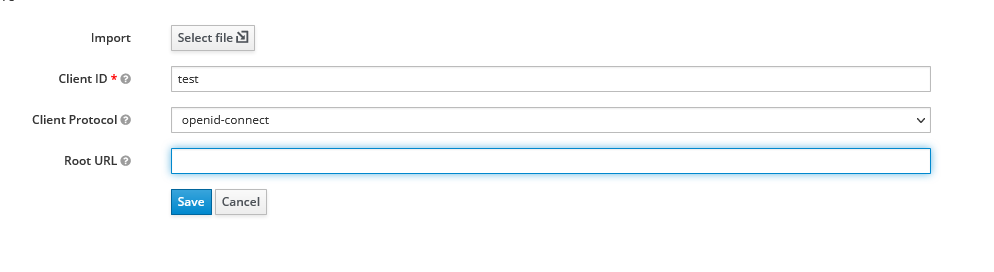
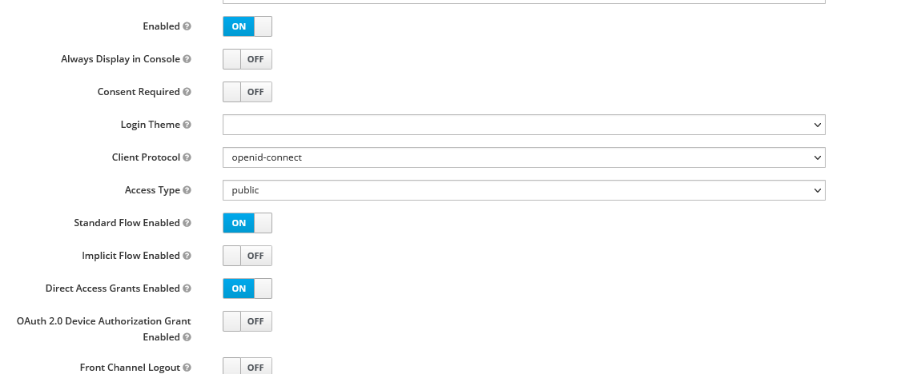
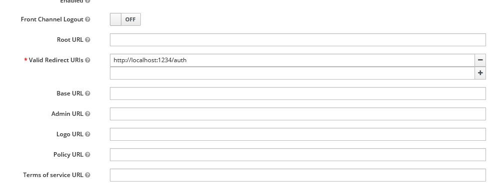
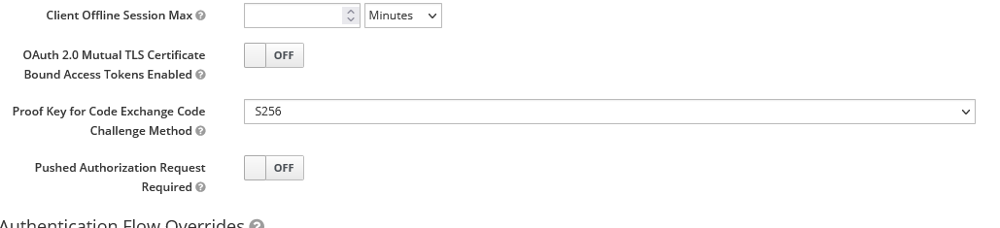

[](https://piral.io)

# [Piral Sample](https://piral.io) &middot; [](https://github.com/smapiot/piral/blob/main/LICENSE) [](https://gitter.im/piral-io/community)

> Sample app shell to use OIDC with PKCE from Keycloak as authentication provider.

:zap: This sample demonstrates using Piral without any plugin to connect to an available identity provider using OpenID connect with the PKCE flow.

You can only run this demo locally. You'll need to run Keycloak using a Docker image as described below.

## Requirements

Besides the Piral requirements (Node.js 12+, npm 6+) you'll need to have Keycloak up and running.

The easiest way is to run keyclock as [Docker image](https://hub.docker.com/r/jboss/keycloak/). With Docker installed that works like:

```sh
docker run -p 8080:8080 -e KEYCLOAK_USER=<USERNAME> -e KEYCLOAK_PASSWORD=<PASSWORD> jboss/keycloak
```

Once you have this successfully running you can go to [http://localhost:8080] and log in via the previously defined admin credentials.

Set up a new client.



Now go into the details of the client. Follow the [instructions from App Developer blog](https://www.appsdeveloperblog.com/pkce-verification-in-authorization-code-grant/). First, provide the right settings:



Importantly, add the right redirect URL. For the CORS rules you can just add a "+", which allows all redirect URLs to be accepted.



Finally, in the advanced settings you'll need to allow the S256 method.



Using this we can call the Keycloak OIDC API just like

```plain
http://localhost:8080/auth/realms/master/protocol/openid-connect/auth
?client_id=test
&response_type=code
&scope=profile openid
&redirect_uri=http://localhost:1234/auth
&state=<whatever>
&code_challenge=<generated-by-us>
&code_challenge_method=S256
```

Let's see how this is used in the Piral instance.

## Getting Started

Install the dependencies:

```sh
npm install
```

If you want to change the values to your auth0 provider then go ahead and modify the values in the *src/client.ts* module. These values need to come from auth0 as shown in the next section.

Now run:

```sh
npm start
```

The app shell should be up and running.

The sample implements:

1. Login using PKCE (no library)
2. Token retrieval incl. token update (w. expiration, but no check on the refresh token; it would just fail and re-login)
3. User info
4. (Global) logout

And all together with a custom pilet API to have convenience on the pilets (esp. to retrieve the current user and request an access token).

## License

Piral and this sample code is released using the MIT license. For more information see the [license file](./LICENSE).
